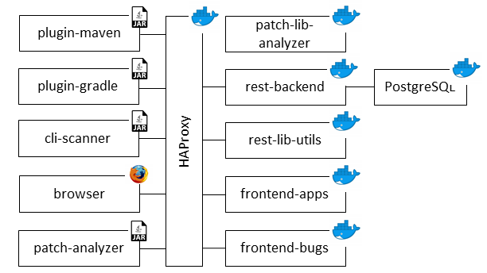

# DevOps

In this tutorial, you will be guided through the necessary steps to set-up the @@PROJECT_NAME@@ backend services.

<center class='expandable'>
    [](./img/components.png)
</center>

!!! warning "Important Remark"

    The setup obtained following these instructions is meant for demonstration purposes.
    It **shall not** be used in productive scenarios (both for security and scalability concerns).
    <!--Detailed instructions on how to operate @@PROJECT_NAME@@ in a productive environment are given in the [Admin Guide](admin_guide.md).-->

## Pre-requisites

- docker
- git

## Installation

### Clone from GitHub

```sh
git clone https://github.com/SAP/vulnerability-assessment-tool
```

### Build Docker images

!!! info "Testing Environment"

    @@PROJECT_NAME@@ was successfully built against

    - Ubuntu 16.04 - Docker version 17.03.2-ce, build f5ec1e2
    - Win10 noWSL - Docker version 18.01.0-ce, build 03596f5

All the following commands are supposed to be executed from the root folder of the project.
Before proceeding, be sure to move there with:

```sh
cd vulnerability-assessment-tool
```

Make a copy of the sample configuration:

```sh
cp docker/.env.sample docker/.env
```

Edit the file `docker/.env` to match your needs.

!!! info "Sensitive information"

	In `docker/.env` you must configure at least `POSTGRES_USER=` and `spring.datasource.username=` (with equal values), you should also configure the `HAPROXY`'s user and password as well as the credentials to access the bugs' frontend

At this point, you are ready to perform the actual build with the following command:

```sh
docker build --tag vulas-build-img -f docker/Dockerfile --build-arg http_proxy= --build-arg https_proxy= .
docker run -it --rm -v ${PWD}/docker:/exporter --env-file ./docker/.env -e mvn_flags=-DexcludedGroups=com.sap.psr.vulas.shared.categories.Slow vulas-build-img
```

!!! warning "Build error"

	If the command above fails, add `-DreuseForks=False` flag to `mvn_flags`. As shown in the example below.

    ```sh
    docker run -it --rm -v ${PWD}/docker:/exporter --env-file ./docker/.env -e mvn_flags='-DexcludedGroups=com.sap.psr.vulas.shared.categories.Slow -DreuseForks=False' vulas-build-img
    ```

In case you are running behind a proxy you need to configure it in the `--build-arg` arguments.

As a result, the folders `docker/<component-name>` will contain compiled JARs (or WARs, depending on the component). The folder `docker/client-tools` will be populated with the JARs for patch-analyzer and cli-scanner.

Finally, you may want to make all artifacts available to the developers of your organization (e.g., through an internal Nexus or other artifact distribution system).

### Run

You are now ready to run the system:

```sh
(cd docker && docker-compose up -d --build)
```

To check that everything started successfully, check the page `http://localhost:8033/haproxy?stats` (user/pwd: `admin/admin`).
All endpoints should appear as green (you may want to replace `localhost` with the actual hostname of your machine).

### Populate/maintain the vulnerability database

In order for the tool to detect vulnerabilities, you need to analyze them first so that they are available in the tool's vulnerability database.

To do so, please follow the instructions mentioned [here](../../../vuln_db/tutorials/vuln_db_tutorial).

## Analyze an application

**Pre-requisite**: Please, make sure you take note of the URL of the **backend service** as well as the URL of the **apps Web frontend**, you will need these:

- Apps Web frontend: [http://localhost:8033/apps](https://localhost:8033/apps)
- Backend service: [http://localhost:8033/backend](http://localhost:8033/backend)

You may want to replace `localhost` with the actual hostname of your machine.

Get going:

1. Setup your [workspace](../../../user/manuals/setup/#workspace) (if you don't have one)
2. Become familiar with the various analysis [goals](../../../user/manuals/analysis/) (first time users)
3. Analyze your [Java](../../../user/tutorials/java_maven) or [Python](../../../user/tutorials/python_cli) application (on a regular basis)
4. [Assess](../../../user/manuals/assess_and_mitigate) findings using the apps Web frontend (following every analysis)

Further links:

- [Configure](../../../user/tutorials/) the client-side analysis
- [Automate](../../../user/tutorials/jenkins_howto) with Jenkins
- [Get help](../../../user/support) if you run into troubles
